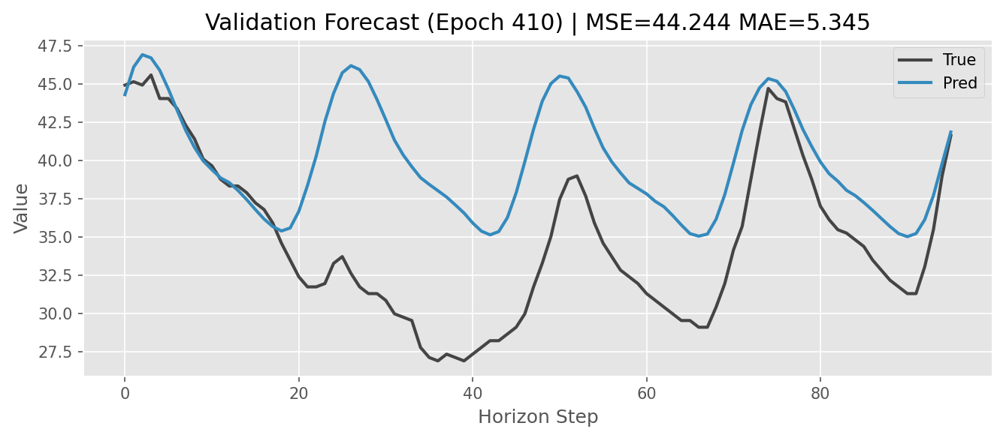
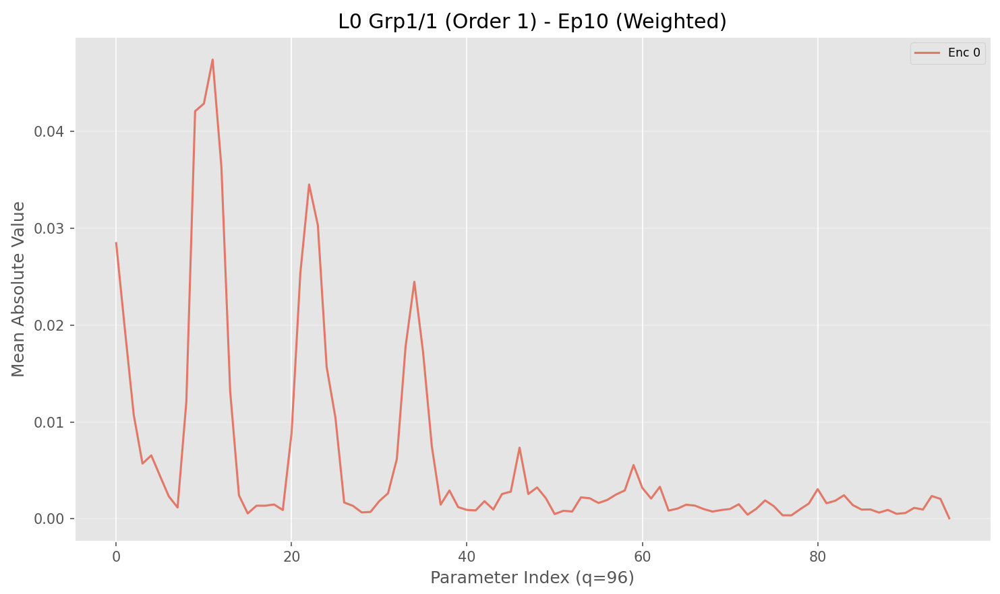

# GI-LSTM: Grouped Independent LSTM for Interpretable Forecasting

**A recurrent forecasting module designed for long-horizon time-series with explicit, parameterized long-range memory.**

---

## Summary

GI-LSTM is a drop-in forecasting module that overcomes RNN/LSTMs' common bottleneck: long-term memory.  
GI-LSTM incorporates **explicit, parameterized long-range memory kernels** () that aggregate past information across multiple time scales.

## Key Capabilities

* **Long-Horizon Forecasting:** Achieves stability over long windows without the computational overhead of pure self-attention.
* **Vectorized Mixture-of-Experts:** Runs multiple independent encoders and decoders in parallel to capture diverse temporal dynamics.
* **Drop-in Compatibility:** Works naturally with **RevIN** (Reversible Instance Normalization) and decomposition modules for trend/residual separation.
* **Native Interpretability:** Unlike "black box" LSTMs, GI-LSTM exposes auditable parameters ( kernels and gating weights) that reveal exactly how the model aggregates history.

## Interpretability & Auditing

GI-LSTM is designed to be interpretable. The model includes built-in hooks to visualize:

1. **Memory Kernel ():** Learned filters over time lags. You can directly observe "memory mass"—identifying exactly which past time steps the model focuses on.
2. **Time-Scale Reliance:** Determine per-step reliance on specific memory groups, providing an interpretable "which scale mattered when" explanation.

*(Run the training script to generate these visualization plots automatically in real-time).*

### **Visualizing Memory Attention**

GI-LSTM provides a window into its decision-making process via the **Theta Kernel Visualization**. 

  

Fig.1. The Long-Term Series Forecasting (LSF) for the ETTh2 dataset. Horizon = 96 (steps ahead), Lookback Window  = 96 (steps ahead) 

  

Fig.2 reveals exactly which parts of the history the model considers important:
* **X-Axis (Lags):** Represents time steps into the past. Indices on the left (marked `FG`) correspond to recursive short-term memory (Forget Gates), while indices on the right correspond to specific skip-connections (Theta Kernels).
* **Y-Axis (Magnitude):** The mean absolute value of the parameters. A higher peak means the model is placing significant weight on that specific time lag.
* **Interpretation:** Sharp peaks at specific intervals (e.g., every 24 steps for hourly data), the model has learned an underlying **seasonality** of the dataset without explicit supervision.

### **Interpretability Mechanism**

Unlike standard RNNs/LSTMS, where hidden states are opaque, the GI_LSTM allows us to directly interpret the parameters as **probability masses** over historical time steps.

The provided visualization demonstrates this distribution:

1. **Sparsity:** The model naturally learns temporal representations.
2. **Focus:** Significant probability mass concentrates on informative lags (peaks) to the GI_LSTM, providing a readable "attention map" of the time-series dynamics.

## Project Structure

The codebase has been refactored for modularity and reproducibility:

* `main.py`: Main function.
* `trainer.py`: Encapsulated training loop with Early Stopping and State Management.
* `arch.py`: Model definitions (GI-LSTM, Encoders, Decoders, RevIN).
* `data_loader.py`: Robust data pipeline with leakage-free normalization.
* `utils.py`: Visualization tools and reproducibility helpers.

---

### License

[MIT License]

---

